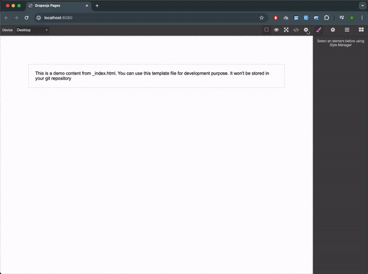

# Grapesjs Pages
Simple projects and templates manage plugin for GrapesJS

[](https://www.npmjs.com/package/grapesjs-pages)
[](https://www.npmjs.com/package/grapesjs-pages)
[](https://www.npmjs.com/package/grapesjs-pages)
[](https://bundlephobia.com/result?p=grapesjs-pages)
[](https://github.com/dipaksarkar/grapesjs-pages/blob/master/LICENSE)


<p style="text-align: center; width: 100%">

</p>

[DEMO](https://jsfiddle.net/dipaksarkar/wq1zbLpm/)


### HTML
```html
<link href="https://unpkg.com/grapesjs/dist/css/grapes.min.css" rel="stylesheet">
<script src="https://unpkg.com/grapesjs"></script>
<script src="https://unpkg.com/grapesjs-pages"></script>

<div id="gjs"></div>
```

### JS
```js
const editor = grapesjs.init({
	container: '#gjs',
  height: '100%',
  fromElement: true,
  storageManager: false,
  plugins: ['grapesjs-pages'],
  pluginsOpts: {
    'grapesjs-pages': { 
      templates: 'http://localhost:3000/templates',
      projects: 'http://localhost:3000/projects',
    }
  }
});
```

### CSS
```css
body, html {
  margin: 0;
  height: 100%;
}
```


## Summary

* Plugin name: `grapesjs-pages`


## Options

| Option | Description | Default |
|-|-|-
| `templates` | Description option | `default null` |
| `projects` | Description option | `default null` |
| `onLoad` | Description option | `default undefined` |
| `onStore` | Description option | `default undefined` |
| `onDelete` | Description option | `default undefined` |


## Download

* CDN
  * `https://unpkg.com/grapesjs-pages`
* NPM
  * `npm i grapesjs-pages`
* GIT
  * `git clone https://github.com/dipaksarkar/grapesjs-pages.git`


## Usage

Directly in the browser
```html
<link href="https://unpkg.com/grapesjs/dist/css/grapes.min.css" rel="stylesheet"/>
<script src="https://unpkg.com/grapesjs"></script>
<script src="path/to/grapesjs-pages.min.js"></script>

<div id="gjs"></div>

<script type="text/javascript">
  var editor = grapesjs.init({
      container: '#gjs',
      // ...
      plugins: ['grapesjs-pages'],
      pluginsOpts: {
        'grapesjs-pages': { /* options */ }
      }
  });
</script>
```

Modern javascript
```js
import grapesjs from 'grapesjs';
import plugin from 'grapesjs-pages';
import 'grapesjs/dist/css/grapes.min.css';

const editor = grapesjs.init({
  container : '#gjs',
  // ...
  plugins: [plugin],
  pluginsOpts: {
    [plugin]: { /* options */ }
  }
  // or
  plugins: [
    editor => plugin(editor, { /* options */ }),
  ],
});
```


## Development

Clone the repository

```sh
$ git clone https://github.com/dipaksarkar/grapesjs-pages.git
$ cd grapesjs-pages
```

Install dependencies

```sh
$ npm i
```

Start the dev server

```sh
$ npm start
```

Build the source

```sh
$ npm run build
```


## License

MIT
